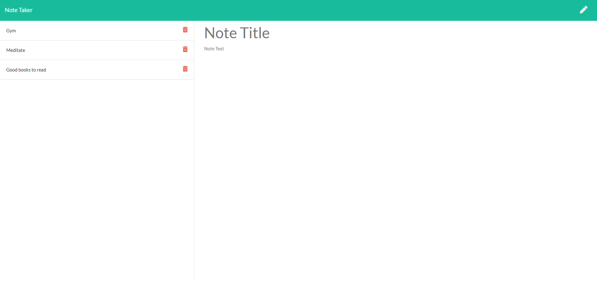

# Note Taker
****
Note Taker is an application that can be used to write, save, and delete notes. Simply click get started and then start adding notes. This application is built with Node and Express.
****
# Deployed Application
<a href="https://frozen-oasis-41950.herokuapp.com/">Note Taker </a>
# Installation
To install the dependencies run the following command:
```
npm i
```
# Startup
To start the application run the following command :
```
npm server
```
# Screenshot

